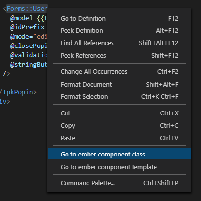

# ember-component-jumper

Ember addon to jum between components from selected text.

## Features

Can open component class or template with right clicking on selected text.

**Works with pods.**

## Extension Settings

Future release

## Known Issues

None